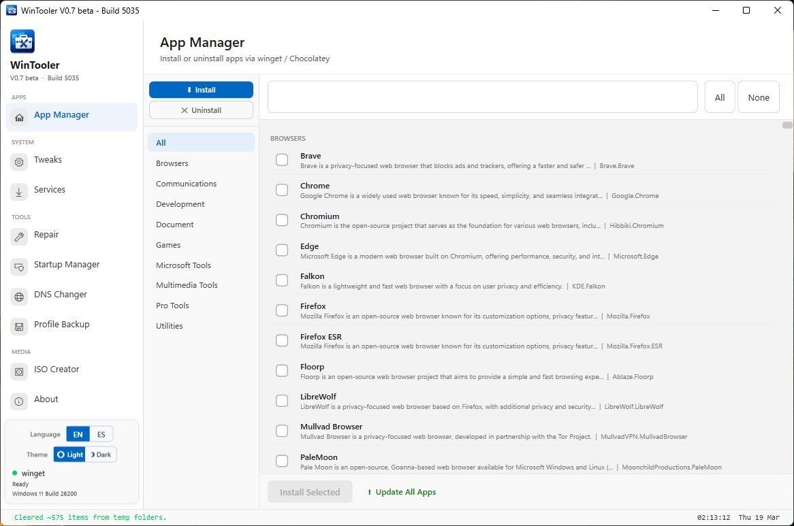
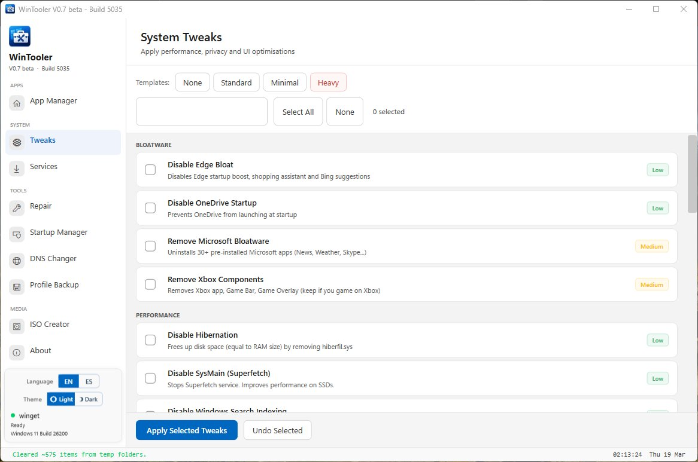
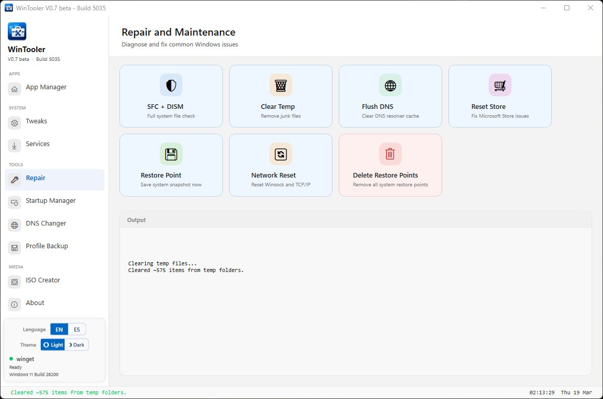
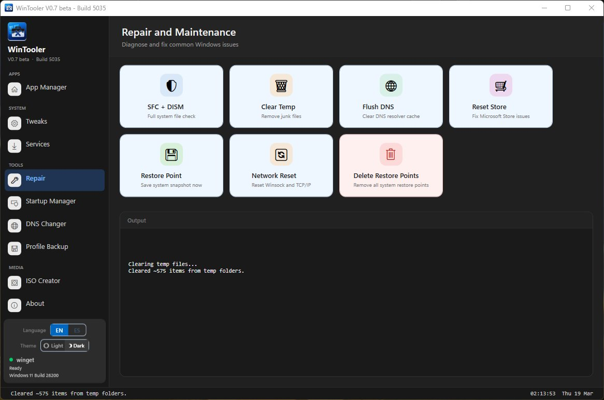
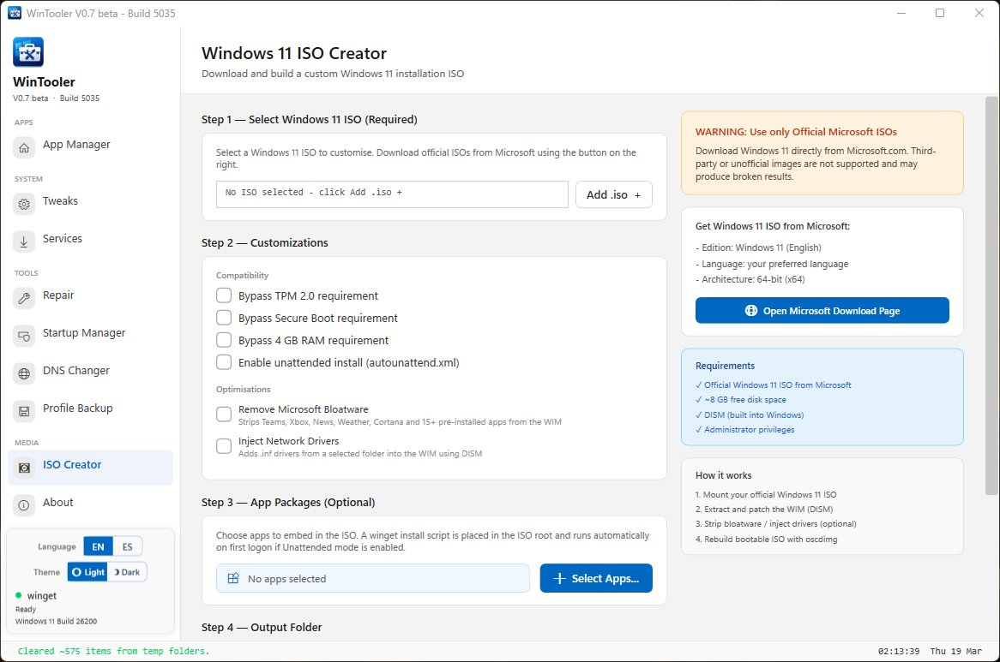

# WinTooler — V0.7.1 beta · Build 5040

<p align="center">
  
</p>

<p align="center">
  <b>A modern Windows 11 optimization, debloat and deployment toolkit</b>
</p>

<p align="center">
  
  
  
  
  
  
</p>

---

## Screenshots

<table>
<tr>
<td width="50%"><br/><sub>App Manager — 376 apps, live search, category filter</sub></td>
<td width="50%"><br/><sub>System Tweaks — 23 tweaks with risk badges and templates</sub></td>
</tr>
<tr>
<td width="50%"><br/><sub>Repair — 7 tools, light mode</sub></td>
<td width="50%"><br/><sub>Repair — dark mode with output console</sub></td>
</tr>
<tr>
<td colspan="2"><br/><sub>ISO Creator — select ISO, customise, embed apps, rebuild</sub></td>
</tr>
</table>

---

## What is WinTooler?

WinTooler is a self-contained PowerShell WPF application for tuning, debloating and deploying Windows 10 and Windows 11. It runs entirely on the built-in PowerShell 5.1 engine — no install, no dependencies, just run as Administrator.

**V0.7.1 beta (Build 5040)** is a maintenance release that resolves all 5 known limitations from Build 5035.

---

## Feature Overview

| Module | Description |
|---|---|
| **App Manager** | Install / uninstall 376 apps across 9 categories via winget. Chocolatey is auto-installed on demand as fallback. Live search + category filter. |
| **System Tweaks** | 23 registry tweaks — Bloatware, Performance, Privacy, UI. Templates: None / Standard / Minimal / Heavy. |
| **Services Manager** | View and set 18 Windows services to Enabled, Disabled or Manual. |
| **Repair & Maintenance** | SFC + DISM, Clear Temp, Flush DNS, Reset Store, Create Restore Point, Network Reset, **Delete All Restore Points**. |
| **Startup Manager** | List, enable and disable registry Run keys and startup folder shortcuts. Auto-starts TaskScheduler if needed. |
| **DNS Changer** | One-click switch to Cloudflare, Google, Quad9, OpenDNS, or any custom DNS pair. |
| **Profile Backup** | Export and import tweak selections as named JSON profiles. |
| **ISO Creator** | Mount official Windows 11 ISO → patch WIM → rebuild bootable ISO. Optional: TPM bypass, bloatware removal, driver injection, app embedding, unattended install. |
| **Light / Dark Mode** | Full Windows 11 Fluent palette. Segoe UI Symbol fallback for Win10 < 19041. |
| **EN / ES Language** | English and Spanish UI with live toggle. |

---

## What's Fixed in V0.7.1

| # | Limitation | Resolution |
|---|---|---|
| 1 | ISO Creator required Windows ADK (oscdimg) | 3-tier fallback: oscdimg → wimlib → .NET ZipFile. Always completes. |
| 2 | ISO app embedding required winget on target | Install-Apps.bat self-bootstraps winget via Add-AppxPackage + aka.ms/getwinget |
| 3 | Chocolatey required separate manual install | App Manager auto-downloads Chocolatey bootstrap on demand |
| 4 | Startup Manager required TaskScheduler running | Handlers auto-start the service; schtasks CLI used as COM-independent fallback |
| 5 | Segoe MDL2 icons invisible on Win10 < 19041 | XAML fallback chain + VisualTreeHelper walk at window load |

---

## Requirements

- Windows 10 (build 19041+) or Windows 11
- PowerShell 5.1 (built into Windows — no install needed)
- **Run as Administrator**
- Internet connection for App Manager (winget / Chocolatey installs)
- ISO Creator: ~8 GB free disk space, DISM (built-in)

---

## Installation

No installer. Download, extract, right-click.

```
1. Download and extract WinTooler_V071beta_Build5040.zip
2. Right-click Launch.bat  →  Run as administrator
```

On first launch: bootstraps winget if absent, creates a System Restore Point, loads all catalogs.

---

## Project Structure

```
BUILD5035/
├── WinToolerV1.ps1                      Main launcher
├── Launch.bat                           Batch launcher
├── scripts/
│   └── gui.ps1                          WPF GUI (~5100 lines)
├── functions/
│   ├── public/Invoke-Win11ISOCreator.ps1
│   ├── private/  (Invoke-Oscdimg, Get-WindowsDownload, Convert-ESDtoISO)
│   ├── repair.ps1
│   └── tweaks.ps1
├── config/
│   ├── wm_apps.json    (376 apps, 9 categories)
│   ├── tweaks.json     (23 tweaks)
│   ├── services.json   (18 services)
│   └── themes.json     (Light / Dark tokens)
└── docs/
    ├── README.md
    ├── RELEASE_NOTES.html   (with embedded screenshots)
    ├── RELEASE_NOTES.txt
    └── screenshots/
```

---

## Roadmap

**v0.8 BETA:** Hosts File Editor, Driver Updater, Performance Benchmarks (WinSAT), Registry Cleaner, WSL Manager, Custom Tweak Builder, more UI languages.

**v1.0 RC:** .msi installer, auto-update notifications, code-signed script, full OS test coverage.

---

## License

GPL-3.0 © ErickP (Eperez98)
